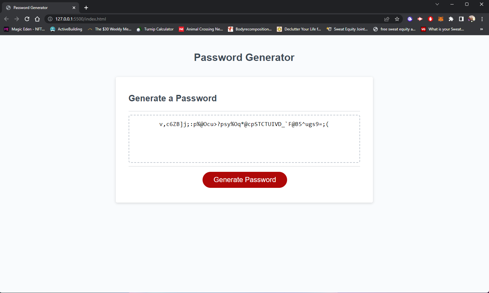

# Challenge03Badgers

## Description
Generates a random and secure password after clicking a button. Nice and easy.

## Functionality
Generator will ask the user about what they want in their password. User will input desired responses and password will be generated due to their requests.
Included parameters:
    - Do they want lowercase?
    - Do they want uppercase?
    - Do they want numbers?
    - Do they want special characters?
    - How long do they want the password (confined between 8 and 128)

## Usage
Link to website: https://badgers93.github.io/Challenge03Badgers/

